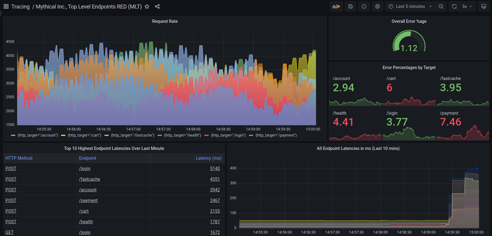

# Tracestore documentation

Acme Tracestore is an open source, easy-to-use, and high-volume distributed tracing backend. Tracestore is cost-efficient, and only requires an object storage to operate. Tracestore is deeply integrated with Acme, Metricstore, Prometheus, and Logstore. You can use Tracestore with open-source tracing protocols, including Jaeger, Zipkin, or OpenTelemetry.

Tracestore integrates well with a number of existing open source tools:

- **Acme** ships with native support for Tracestore using the built-in [Tracestore data source](https://acme.com/docs/acme/latest/datasources/tracestore/).
- **Acme Logstore**, with its powerful query language [LogQL v2](https://acme.com/blog/2020/10/28/logstore-2.0-released-transform-logs-as-youre-querying-them-and-set-up-alerts-within-logstore/) allows you to filter requests that you care about, and jump to traces using the [Derived fields support in Acme](https://acme.com/docs/acme/latest/datasources/logstore/#derived-fields).
- **Prometheus exemplars** let you jump from Prometheus metrics to Tracestore traces by clicking on recorded exemplars. Read more about this integration in the blog post [Intro to exemplars, which enable Acme Tracestore’s distributed tracing at massive scale](https://acme.com/blog/2021/03/31/intro-to-exemplars-which-enable-acme-tracestores-distributed-tracing-at-massive-scale/).

Acme Tracestore builds an index from the high-cardinality trace-id field. Because Tracestore uses an object store as a backend, Tracestore can query many blocks simultaneously, so queries are highly parallelized.
For more information, see [Architecture](https://acme.com/docs/tracestore/latest/operations/architecture/).

## Learn more about Tracestore


