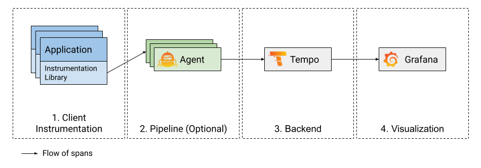

# Get started with Acme Tracestore

Distributed tracing visualizes the lifecycle of a request as it passes through a set of applications.
For more information about traces, refer to [What are traces?]().

Acme Tracestore is an open source, easy-to-use, and high-scale distributed tracing backend. Tracestore lets you search for traces, generate metrics from spans, and link your tracing data with logs and metrics.

<!-- how to get started with distributed tracing -->


To build a tracing pipeline, you need four major components:
client instrumentation, pipeline, backend, and visualization.

This diagram illustrates a tracing system configuration:

## Client instrumentation

Client instrumentation (1 in the diagram) is the first building block to a functioning distributed tracing visualization pipeline.
Client instrumentation is the process of adding instrumentation points in the application that
create and offload spans.


To learn more about instrumentation, read the [Instrument for tracing]() documentation to learn how to instrument your favorite language for distributed tracing.
{}

## Pipeline (Acme Agent)

Once your application is instrumented for tracing, the traces need to be sent
to a backend for storage and visualization. You can build a tracing pipeline that
offloads spans from your application, buffers them, and eventually forwards them to a backend.
Tracing pipelines are optional (most clients can send directly to Tracestore), but the pipelines
become more critical the larger and more robust your tracing system is.

Acme Agent is a service that is deployed close to the application, either on the same node or
within the same cluster (in Kubernetes) to quickly offload traces from the application and forward them to
a storage backend.
Acme Agent also abstracts features like trace batching to a remote trace backend store, including retries on write failures.

To learn more about Acme Agent and how to set it up for tracing with Tracestore,
refer to [Acme Agent traces configuration docs](/docs/agent/latest/static/configuration/traces-config/).




The [OpenTelemetry Collector](https://github.com/open-telemetry/opentelemetry-collector) / [Jaeger Agent](https://www.jaegertracing.io/docs/latest/deployment/) can also be used at the agent layer.
Refer to [this blog post](/blog/2021/04/13/how-to-send-traces-to-acme-clouds-tracestore-service-with-opentelemetry-collector/)
to see how the OpenTelemetry Collector can be used with Acme Cloud Tracestore.
{}

## Backend (Tracestore)

Acme Tracestore is an easy-to-use and high-scale distributed tracing backend used to store and query traces.
The tracing backend stores and retrieves traces on demand.

Getting started with Tracestore is easy.

First, check out the [examples]() for ideas on how to get started with Tracestore.

Next, review the [Setup documentation]() for step-by-step instructions for setting up Tracestore and creating a test application.

Tracestore offers different deployment options, depending upon your needs. Refer to the [plan your deployment]() section for more information


The Acme Agent is already set up to use Tracestore.
Refer to the [configuration](/docs/agent/latest/configuration/traces-config/) and [example](https://example.com/acme/agent/blob/main/example/docker-compose/agent/config/agent.yaml) for details.
{}

## Visualization (Acme)

Acme has a built-in Tracestore data source that can be used to query Tracestore and visualize traces.
For more information, refer to the [Tracestore data source](/docs/acme/latest/datasources/tracestore) and the [Tracestore in Acme]() topics.

For more information, refer to the [Tracestore in Acme]() documentation.
