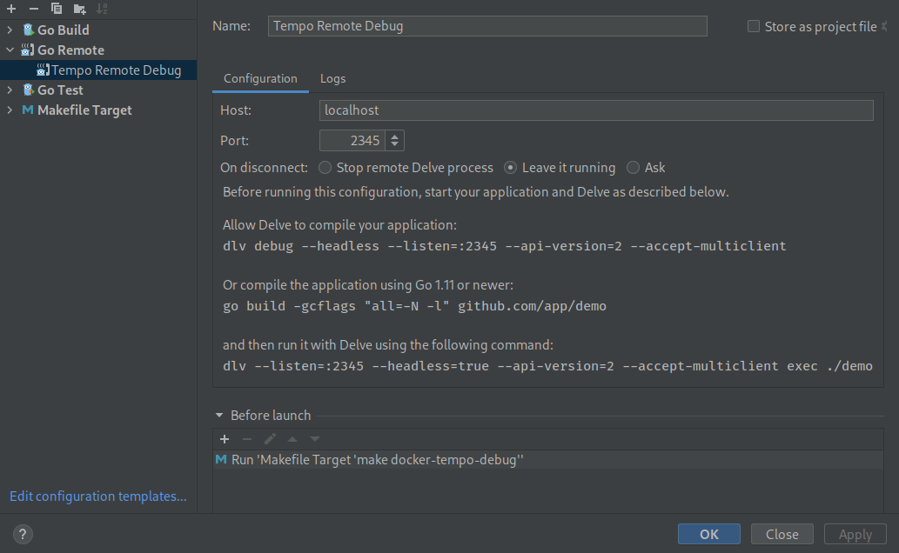

## Remote Debugging

How to use remote debugging with Tracestore. This example builds on the [local example](../local), for 
questions about the general setup, please refer to its readme file.

Although it is possible to debug Tracestore with [`dlv debug`](https://github.com/go-delve/delve/blob/master/Documentation/usage/dlv_debug.md), 
this approach also has disadvantages in scenarios where it is desirable to run Tracestore inside a container. 
This example demonstrates how to debug Tracestore running in docker-compose.

The make target `docker-tracestore-debug` compiles tracestore without optimizations and creates a docker 
image that runs Tracestore using [`dlv exec`](https://github.com/go-delve/delve/blob/master/Documentation/usage/dlv_exec.md).

1. Build the tracestore debug image:

```console
make docker-tracestore-debug
```

To distinguish the debug image from the conventional Tracestore image its is tagged with `acme/tracestore-debug`. Let’s see if the image is present:

```console
docker images | grep acme/tracestore-debug
```
```
acme/tracestore-debug                            latest                         3d6789d20dc3   2 days ago      112MB
```

2. Take a look at tracestore service in the [docker-compose.yaml](./docker-compose.yaml). The environment
variable `DEBUG_BLOCK` controls whether delve halts the execution of Tracestore until a debugger is connected.
Setting this option to `1` is helpful to debug errors during the start-up phase.

3. Now start up the stack.

```console
docker-compose up -d
```

At this point, the following containers should be running.

```console
docker-compose ps
```
```
       Name                     Command               State                            Ports                         
---------------------------------------------------------------------------------------------------------------------
debug_acme_1      /run.sh                          Up      0.0.0.0:3000->3000/tcp,:::3000->3000/tcp               
debug_k6-tracing_1   /k6-tracing run /example-s ...   Up                                                             
debug_prometheus_1   /bin/prometheus --config.f ...   Up      0.0.0.0:9090->9090/tcp,:::9090->9090/tcp               
debug_tracestore_1        /entrypoint-debug.sh -conf ...   Up      0.0.0.0:14268->14268/tcp,:::14268->14268/tcp,          
                                                              0.0.0.0:2345->2345/tcp,:::2345->2345/tcp,              
                                                              0.0.0.0:3200->3200/tcp,:::3200->3200/tcp,              
                                                              0.0.0.0:4317->4317/tcp,:::4317->4317/tcp,              
                                                              0.0.0.0:4318->4318/tcp,:::4318->4318/tcp,              
                                                              0.0.0.0:9411->9411/tcp,:::9411->9411/tcp 
```

4. The tracestore container exposes delves debugging server at port `2345` and it is now possible to 
connect to it and debug the program. If you prefer to operate delve from the command line you can connect to it via:

```console
dlv connect localhost:2345
```

Goland users can connect with the [Go Remote](https://www.jetbrains.com/help/go/go-remote.html) run 
configuration:



5. To stop the setup use.

```console
docker-compose down -v
```
